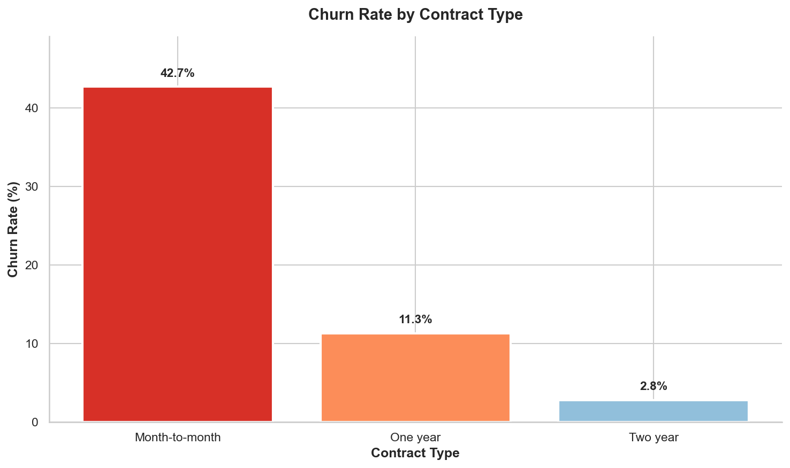
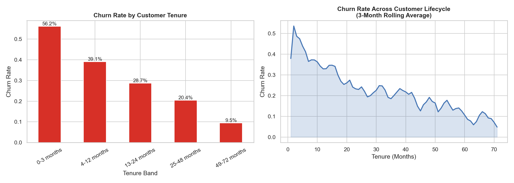
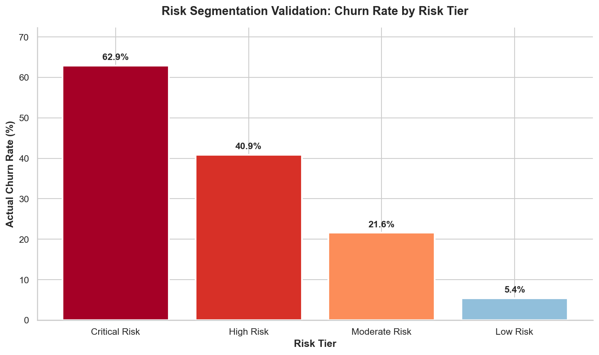

# Telco Customer Churn Analysis

A comprehensive analysis of telecom customer churn, identifying key retention drivers and developing an actionable risk segmentation framework.

## Project Overview

**Business Problem:** Telecom company experiencing 26.5% customer churn rate, representing $1.67M in annual revenue loss. Leadership needs to understand churn drivers and prioritize retention efforts.

**Solution:** End-to-end data analysis delivering predictive insights, customer behavioral profiling, and a rule-based risk scoring system to identify high-risk customers for targeted retention campaigns.

## Key Findings

- **Contract type** is the dominant churn predictor (month-to-month customers churn at 42.7% vs 2.8% for two-year)
- **First 12 months** are critical (47.4% churn vs 17.1% after year one)
- **Value perception gap**: High-paying customers with low service adoption churn at 57.8%
- **Risk framework** identifies 2,598 high-risk customers representing $100K+ monthly revenue exposure

## Interactive Dashboard

**[Launch Live Demo →](https://huggingface.co/spaces/gg-dever/telco-churn-dashboard)**

Experience the analysis interactively! The Streamlit dashboard includes:

- **Overview**: Real-time metrics and key visualizations
- **Risk Analyzer**: Filter customers by risk profile with dynamic charts
- **Churn Predictor**: Enter customer details to predict churn risk
- **ROI Calculator**: Model retention campaign impact and financial projections

To run locally:
```bash
pip install -r requirements.txt
streamlit run streamlit_app.py
```

## Sample Visualizations

### Contract Type Impact on Churn

*Month-to-month contracts show 15x higher churn than two-year contracts*

### Tenure Lifecycle Analysis

*First 12 months represent critical retention window with elevated churn rates*

### Risk Segmentation Validation

*Framework successfully separates customers into distinct risk tiers with 5.4% to 62.9% churn range*

## Repository Structure

```
da_project_1/
├── data/
│   └── telco_churn.csv                    # Source dataset
├── images/                                 # Sample visualizations for README
│   ├── contract_churn_comparison.png
│   ├── risk_tier_validation.png
│   └── tenure_cohort_analysis.png
├── notebooks/
│   ├── telco_churn_portfolio.ipynb        # ⭐ START HERE - Streamlined analysis
│   └── telco_churn.ipynb                  # Full technical deep-dive
├── output/
│   ├── high_risk_customers.csv            # Actionable retention list
│   └── charts/                            # All executive-ready visualizations
├── .streamlit/
│   └── config.toml                        # Streamlit theme configuration
├── streamlit_app.py                       # Interactive dashboard
├── requirements.txt                       # Python dependencies
├── INTERVIEW_PREP.md                      # Talking points and Q&A prep
├── PROJECT_SUMMARY.md                     # One-page project overview
└── README.md
```

## Getting Started

### Recommended Reading Order:

1. **Portfolio Version** (`telco_churn_portfolio.ipynb`) - 15-20 min read
   - Concise narrative focused on business impact
   - Key visualizations and insights
   - Best for initial portfolio review

2. **Full Technical Analysis** (`telco_churn.ipynb`) - 45-60 min read
   - Comprehensive methodology and validation
   - Multiple modeling approaches compared
   - SQL queries and detailed statistical tests

### Requirements

```bash
pip install pandas numpy matplotlib seaborn scikit-learn
```

## Analysis Highlights

### 1. Predictive Modeling
- Logistic Regression with class balancing
- 80% recall on churners (captures 4 out of 5 at-risk customers)
- AUC = 0.85 (strong discriminative ability)

### 2. Behavioral Profiling
- Churned customers pay 21% more monthly but receive fewer services
- Tenure half that of retained customers (18 vs 38 months)
- Paperless billing + electronic check = highest risk combination

### 3. Revenue Impact
- $139,128/month lost to churn
- Month-to-month contracts represent 47% of revenue at risk
- Early-stage customers (0-12 months) drive majority of losses

### 4. Risk Segmentation Framework
- Rule-based scoring system (0-11 points)
- Four risk tiers with validated churn separation:
  - Critical Risk: 62.9% churn rate
  - High Risk: 40.9% churn rate
  - Moderate Risk: 21.6% churn rate
  - Low Risk: 5.4% churn rate

## Deliverables

1. **High-Risk Customer List** - 2,598 customers prioritized for retention outreach
2. **Executive Visualizations** - Publication-ready charts for stakeholder presentation
3. **Actionable Recommendations** - Specific retention strategies with estimated ROI
4. **Reproducible Analysis** - Fully documented code and methodology

## Technical Stack

- **Data Processing:** Pandas, NumPy
- **Visualization:** Matplotlib, Seaborn, Plotly (interactive)
- **Modeling:** Scikit-learn (Logistic Regression, Random Forest)
- **Dashboard:** Streamlit
- **Database:** SQLite for query validation

## Business Recommendations

**High Priority:**
- Contract conversion campaigns for month-to-month customers with Risk Score ≥6
- Early lifecycle check-ins at 60-day mark for new customers
- Estimated impact: $10-15K monthly revenue preserved

**Medium Priority:**
- Bundle promotions for high-cost, low-service customers (dual retention + upsell)

## About This Project

This analysis demonstrates:
- Business-focused analytical thinking
- End-to-end data science workflow (EDA → Modeling → Risk Framework → Executive Reporting)
- Statistical modeling with practical constraints
- Translating technical insights into executive communication
- Delivering actionable recommendations with quantified impact

## Dataset

[Telco Customer Churn Dataset on Kaggle](https://www.kaggle.com/datasets/blastchar/telco-customer-churn)

---

**Status:** Complete - Available for review  
**Last Updated:** March 2026
